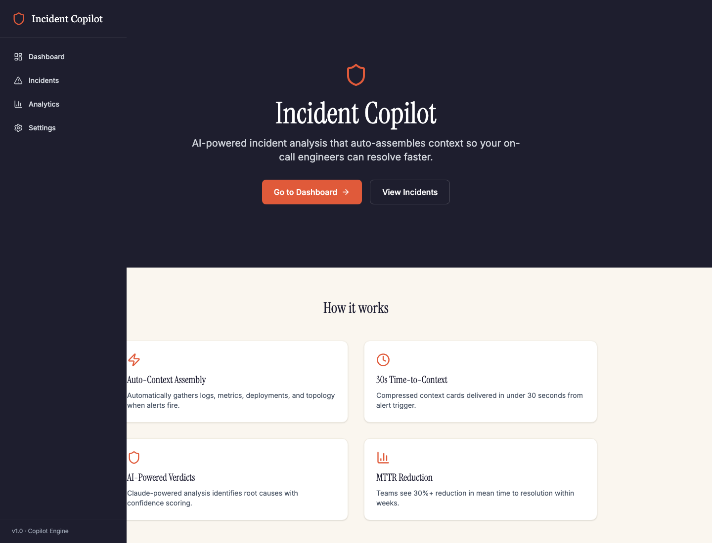
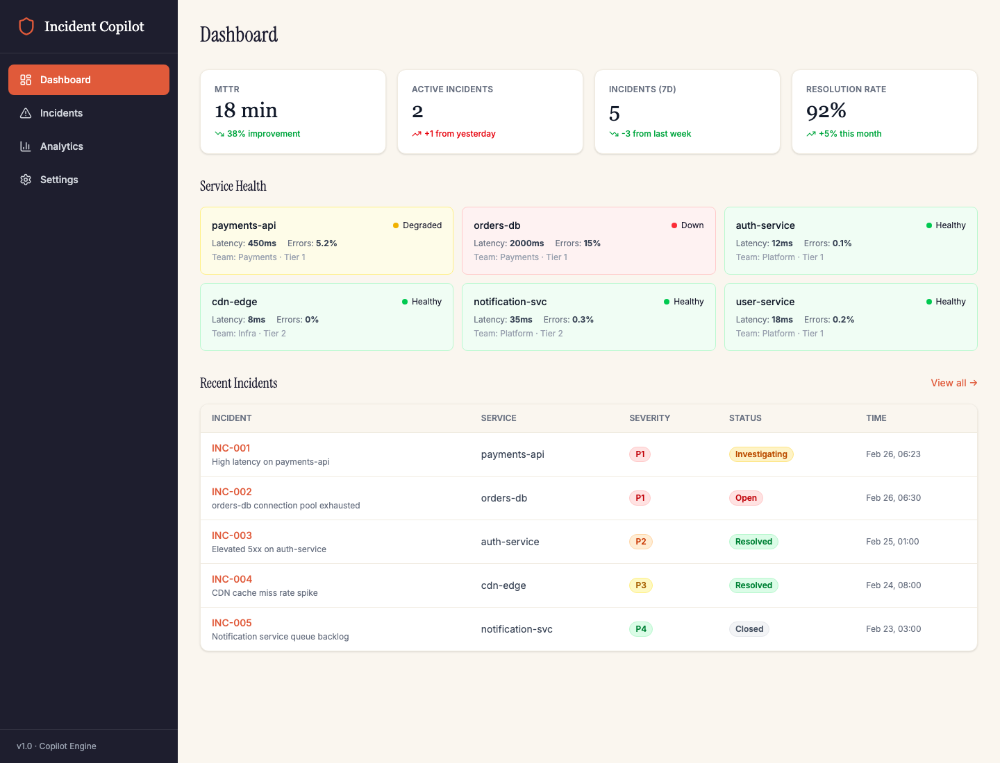
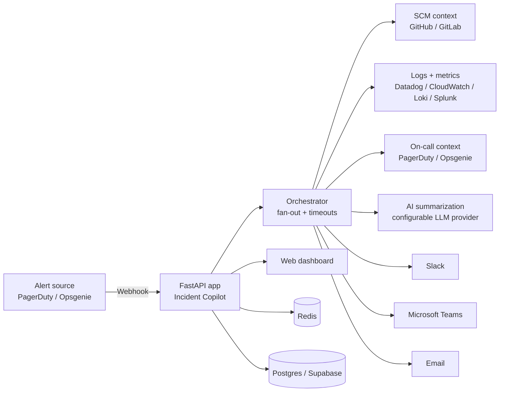

<div align="center">

# Incident Copilot

**Open-source incident context assembly for on-call teams.**
Incident Copilot turns alerts into structured “what changed / what’s broken / where to look” context cards so responders can start fixing instead of spelunking.

[Live demo](https://incident-copilot-preview.vercel.app) · [Docs](./docs/index.md) · [Quickstart](./docs/getting-started/quickstart.md) · [Roadmap](./ROADMAP.md) · [Contributing](./CONTRIBUTING.md) · [Security](./SECURITY.md)

[](https://github.com/jianxux/incident-copilot/actions/workflows/ci.yml)
[](./LICENSE)
[](https://www.python.org/downloads/)
[](https://fastapi.tiangolo.com/)

</div>

---

## Project status

Incident Copilot is an early-stage open-source project. The core app, integration adapters, docs, and tests are available in this repository under the Apache License 2.0. Expect some rough edges, but contributions, issues, and design feedback are welcome.

> **Safety principle:** Incident Copilot is designed to be read-only by default. It assembles context and recommendations; it should not perform automated remediation without explicit human review.

## Why this exists

Every incident starts with the same scramble:

- What changed recently?
- Where are the errors or anomalous metrics?
- Who owns this service?
- Is there a runbook or previous related incident?
- What should we check first?

Incident Copilot answers those questions by fanning out to your operational tools, compressing the noisy evidence, and delivering a concise **context card** to responders.

## What it does today

When an alert or incident arrives, Incident Copilot can:

- **Ingest alerts** from PagerDuty and Opsgenie webhooks
- **Collect context** from source control, logs, metrics, and on-call providers
- **Summarize evidence** into human-readable incident briefs with configurable LLM providers
- **Deliver updates** to Slack, Microsoft Teams, email, and the web dashboard
- **Expose a FastAPI app** with health checks, metrics, and server-rendered UI pages
- **Run locally or self-hosted** with Docker, `uv`, or Kubernetes/Helm

## Integrations

Integrations are adapter-based and live under [`src/integrations/`](./src/integrations/).

| Category | Supported adapters |
| --- | --- |
| Alerting / on-call | PagerDuty, Opsgenie |
| Source control / deploy context | GitHub, GitLab |
| Logs / observability | Datadog, AWS CloudWatch Logs, Grafana Loki, Splunk |
| Notifications | Slack, Microsoft Teams, Email (SMTP / SES) |
| Ticketing / ITSM | Jira, Linear, ServiceNow |

Some integrations are more complete than others. If you are adding or hardening an adapter, please open a focused PR and include tests or fixtures where possible.

## Preview

Temporary Vercel preview: <https://incident-copilot-preview.vercel.app>

### Landing page



### On-call workflow dashboard

This view shows how on-call responders can move from alert context to service health, active incidents, severity/status, and recent incident details.



## How it works



For a deeper architecture overview, see [`docs/architecture.md`](./docs/architecture.md).

## Quickstart

### Prerequisites

- Python 3.11+
- Docker and Docker Compose (recommended for local dependencies)
- `uv` for local Python development: <https://docs.astral.sh/uv/getting-started/installation/>

### Run with Docker

```bash
git clone https://github.com/jianxux/incident-copilot.git
cd incident-copilot

cp .env.example .env
# edit .env with local secrets and provider settings

docker compose up --build
```

Then open:

- App: <http://localhost:8000>
- Health: <http://localhost:8000/health>
- Metrics: <http://localhost:8000/metrics>

### Run locally with uv

```bash
git clone https://github.com/jianxux/incident-copilot.git
cd incident-copilot

cp .env.example .env
make install-dev
make dev
```

If you run without Docker, configure `REDIS_URL` and any required database/provider settings in `.env`.

## Configuration

Start from `.env.example`. The minimal useful setup is:

- one alert source secret (PagerDuty or Opsgenie)
- one notification destination (Slack, Teams, or email)
- optional but recommended source-control credentials (GitHub or GitLab)
- optional but recommended log/metrics provider credentials
- optional LLM provider credentials if you want generated summaries

Never commit real tokens or customer data. `.env` is intentionally ignored by git.

### Database and cache placeholders

`.env.example` intentionally uses placeholders for database/cache connection strings:

```bash
DATABASE_URL=postgresql+asyncpg://<db_user>:<db_password>@<db_host>:<db_port>/<db_name>
REDIS_URL=redis://<redis_host>:<redis_port>/<redis_db>
```

Replace those values only in your local `.env` or deployment secret manager:

- `<db_user>` / `<db_password>`: your Postgres credentials
- `<db_host>` / `<db_port>` / `<db_name>`: your Postgres host, port, and database name
- `<redis_host>` / `<redis_port>` / `<redis_db>`: your Redis host, port, and DB index

For local Docker development, you can use the credentials defined by `docker-compose.yml`. For production, use managed secrets and never commit the resolved URLs.

## Development

```bash
make help          # list available commands
make install-dev   # install development dependencies
make format        # run formatters
make lint          # run linters
make test          # run tests
make check         # lint + typecheck + tests where configured
make dev           # start the development server
```

Repo layout:

```text
src/
  api/             # FastAPI routes: webhooks, health, metrics, app pages
  integrations/    # External service adapters
  ai/              # Summarization and compression helpers
  web/             # Server-rendered dashboard and static assets
  auth/            # Auth, OAuth, SSO/SAML helpers
  orchestrator.py  # Context assembly fan-out
frontend/          # Optional frontend assets
helm/              # Helm chart
scripts/           # Maintenance and validation scripts
tests/             # Unit and integration tests
```

## Contributing

Contributions are welcome. Good first contributions include:

- fixing bugs with a regression test
- improving docs or setup instructions
- adding provider fixtures for integrations
- hardening adapter error handling and timeouts
- improving evaluation coverage for incident summaries

Please read [`CONTRIBUTING.md`](./CONTRIBUTING.md) before opening a PR. By contributing, you agree that your contribution is licensed under Apache-2.0, the same license as this project.

## Security

Please do **not** open public issues for vulnerabilities. See [`SECURITY.md`](./SECURITY.md) for private reporting guidance.

Incident Copilot may connect to sensitive operational systems. Treat logs, traces, alert payloads, and generated summaries as potentially sensitive data.

## Open-source license

Incident Copilot is open source under the **Apache License 2.0**.

You may use, copy, modify, distribute, and run the project — including commercially — subject to the terms in [`LICENSE`](./LICENSE). Apache-2.0 includes an explicit patent grant and is widely used for infrastructure and developer tooling projects.
