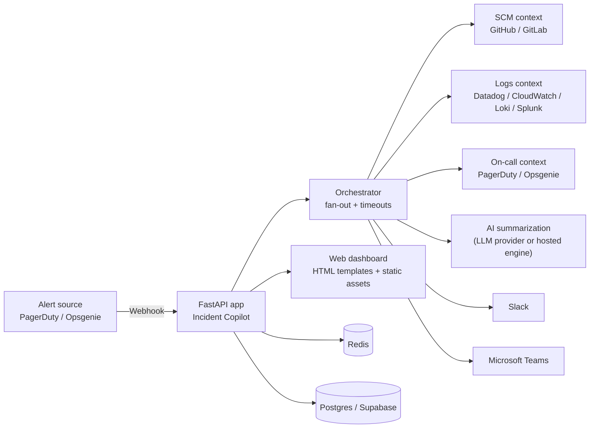

<div align="center">

# Incident Copilot

**Stop wasting the first 15 minutes of every incident.**  
Incident Copilot assembles the “what changed / what’s broken / where to look” context automatically when an alert fires — so on-call can start fixing, not spelunking.

[Live demo](https://incident-copilot-production.up.railway.app) · [Docs](./docs/index.md) · [Roadmap](./ROADMAP.md) · [Contributing](./CONTRIBUTING.md)

<!-- Badges -->
[](https://github.com/jianxux/incident-copilot/actions/workflows/ci.yml)
[](./LICENSE)
[](https://www.python.org/downloads/release/python-3110/)
[](https://fastapi.tiangolo.com/)

</div>

---

## Why this exists

Every incident starts the same way:

- *What changed recently?*
- *Where are the errors?*
- *Who owns this service?*
- *Do we have a runbook?*

Incident Copilot answers those questions in seconds by fanning out to your tools (PagerDuty/Opsgenie, GitHub/GitLab, Datadog/CloudWatch/Splunk/Loki, etc.) and delivering a structured **context card** to Slack/Teams and the web dashboard.

> Time matters. The goal is to reduce the “context gap” between **alert → first meaningful action**.

---

## What it does (today)

When an alert/incident arrives via webhook, Incident Copilot can:

- **Ingest** alerts from PagerDuty and Opsgenie webhooks
- **Enrich** with:
  - recent code changes / deploy context (GitHub, GitLab)
  - logs from your chosen provider (Datadog, CloudWatch Logs, Grafana Loki, Splunk)
  - on-call context (provider-dependent)
- **Summarize** noisy logs into a human-readable brief using an LLM (see note below)
- **Deliver** the context to **Slack** and/or **Microsoft Teams**
- **Serve** a lightweight **web UI** (dashboard, timeline, incident detail, onboarding pages)

### About AI

This repository contains the **platform** (web app, integrations, auth, storage, UI).  
The hosted product uses a separate/private AI engine service; locally/self-hosted you can run with your own LLM credentials (e.g. Anthropic) via environment variables.

---

## Screenshots

Image assets are maintained under `docs/user-guide/images/`.
If you are adding/updating screenshots, follow `docs/user-guide/images/README.md`.

---

## Architecture (high level)



If you want the detailed breakdown, see [`docs/architecture.md`](./docs/architecture.md).

---

## Getting Started (local dev)

For a full walkthrough, see `docs/getting-started/quickstart.md`. For local dev, the short path is:

1. `cp .env.example .env` and set required credentials
2. `docker compose up --build`
3. Open `http://localhost:8000` and verify `http://localhost:8000/health`

### Local development (uv)

- Python **3.11+** is required; `uv` will manage the interpreter and environment for this project.
- Install `uv`: https://docs.astral.sh/uv/getting-started/installation/
- Install dev dependencies: `make install-dev`
- Run tests: `make test`

### Detailed local setup

### Prerequisites

- **Python 3.11**
- **Docker** (recommended) or a local Redis

### 1) Configure env

```bash
git clone https://github.com/jianxux/incident-copilot.git
cd incident-copilot

cp .env.example .env
# edit .env
```

Minimal setup to receive webhooks and render the UI:

- `SLACK_BOT_TOKEN` (or `TEAMS_WEBHOOK_URL`)
- one alert source secret (PagerDuty or Opsgenie)
- one log provider (optional but recommended)
- one SCM provider (optional but recommended)

### 2) Run with Docker (recommended)

```bash
docker compose up --build
```

Then open:

- App: http://localhost:8000
- Health: http://localhost:8000/health
- Metrics (Prometheus): http://localhost:8000/metrics

### 2b) Run with Python (uv)

```bash
make install-dev
make dev
```

> Note: `docker-compose` runs Redis for you. If running without Docker, set `REDIS_URL` and ensure Redis is available.

---

## Webhooks

- PagerDuty (Generic Webhook v3):
  - `POST /webhooks/pagerduty`
- Opsgenie:
  - `POST /webhooks/opsgenie`

There’s also:

- `GET /webhooks/health` (receiver health check)

See [`docs/integration-guide.md`](./docs/integration-guide.md) for step-by-step provider setup.

---

## Integrations

> Integrations are implemented as adapters under [`src/integrations/`](./src/integrations/). Some require extra configuration and credentials.

### Alerting / on-call

- PagerDuty
- Opsgenie

### SCM / deploy context

- GitHub
- GitLab

### Logs

- Datadog
- AWS CloudWatch Logs
- Grafana Loki
- Splunk

### Notifications

- Slack
- Microsoft Teams
- Email (SMTP / SES)

### Ticketing / ITSM (optional)

- Jira
- Linear
- ServiceNow

---

## Repo layout

```
src/
  api/            # FastAPI routes (webhooks, health, etc.)
  integrations/   # External service adapters
  ai/             # Summarization / compression helpers
  web/            # Server-rendered dashboard + static assets
  auth/           # Auth, OAuth, SSO/SAML
  orchestrator.py # Context assembly fan-out
frontend/         # Optional Next.js frontend (separate)
helm/             # Helm chart
```

---

## Development

```bash
make install   # install deps
make format    # run black + isort
make lint      # run ruff checks
make test      # run tests
make dev       # start dev server (if configured)
```

See [`CONTRIBUTING.md`](./CONTRIBUTING.md) for the workflow, coding standards, and how to add integrations.

---

## Deployment

- **Docker**: `docker-compose.yml` for local
- **Kubernetes**: Helm chart under [`helm/`](./helm/)
- **Hosted demo**: deployed on Railway at https://incident-copilot-production.up.railway.app

More details in [`docs/deployment.md`](./docs/deployment.md).

---

## License

This project is licensed under the **Business Source License 1.1 (BSL 1.1)**.

- You may **copy, modify, and self-host** for non-production use.
- You may **not** run it as a **Commercial Hosting Service** (see `LICENSE`).
- On the **Change Date** (four years from first public release of a given version), the license converts to **Apache 2.0**.

See [`LICENSE`](./LICENSE) for the exact terms.
