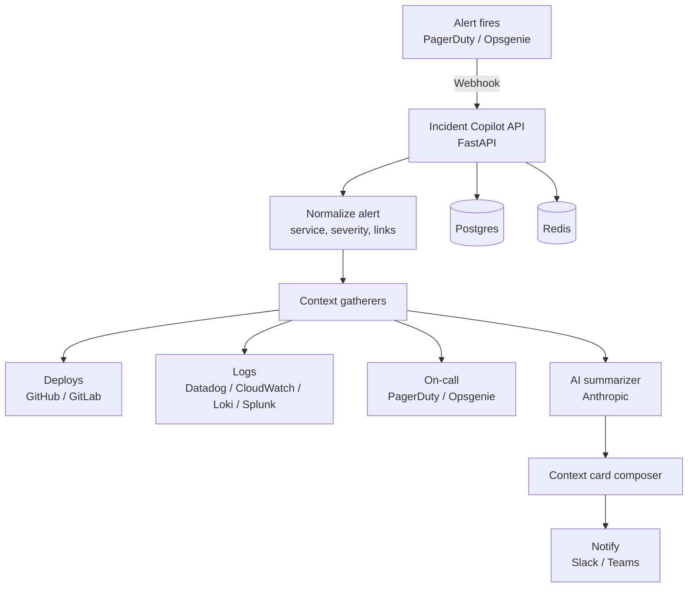

# Architecture

Incident Copilot is a webhook-driven pipeline that assembles incident context and delivers it to your chat tools.

## High-level flow

## Components

### API service (FastAPI)

- Receives webhooks from alert providers.
- Authenticates/validates incoming requests (signing secrets).
- Enqueues or executes context gathering.

### Context gatherers

- Source control: recent deploys, commits, PRs
- Observability: relevant logs by time window and service label
- On-call: who’s responsible right now

### Summarization

The AI step turns raw signals into:

- a short incident summary
- suspected root causes
- suggested next checks

### Delivery

- Slack: rich blocks / message formatting
- Teams: incoming webhook card

## Design goals

- **Fast to context**: deliver useful info in <1–2 minutes.
- **Least privilege**: use scoped tokens and secrets.
- **Pluggable providers**: swap log providers and SCM providers.
- **Self-hostable**: run on Docker/Kubernetes/Railway.
